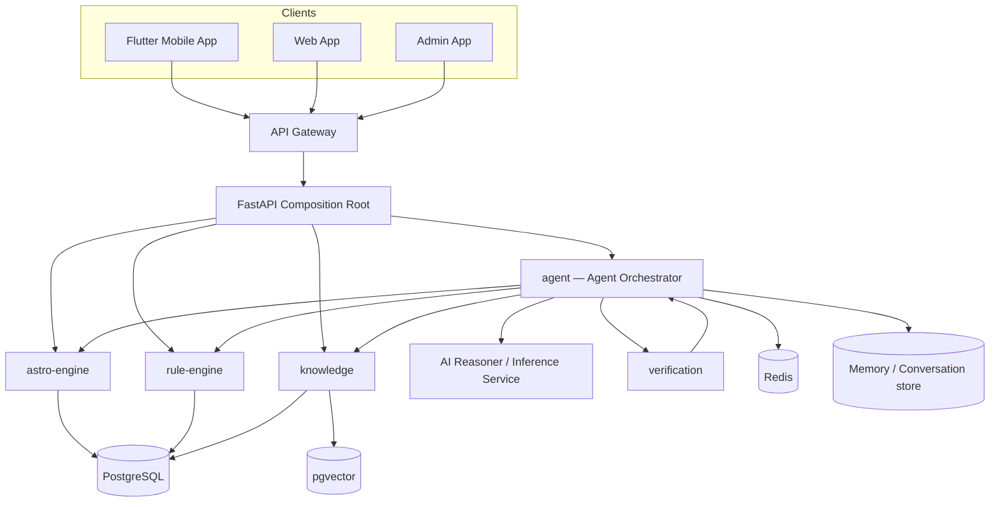
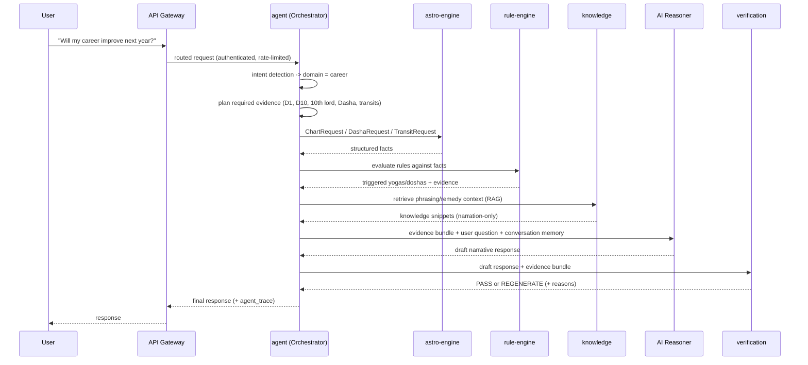
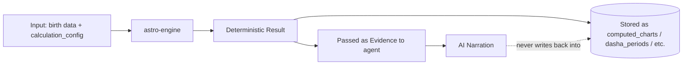
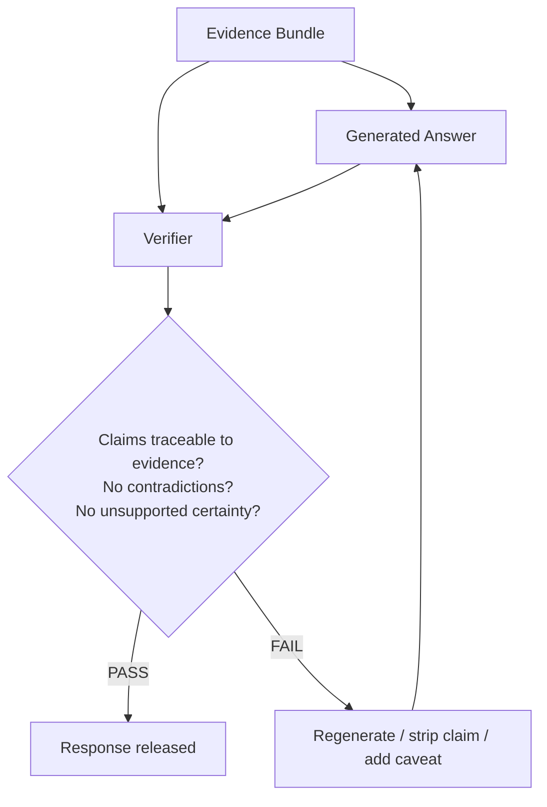
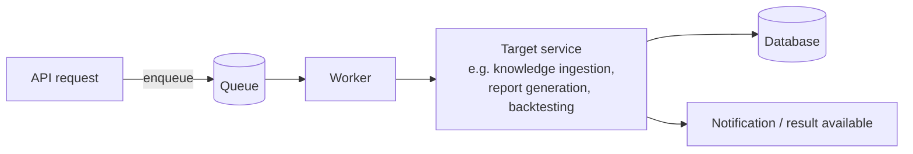
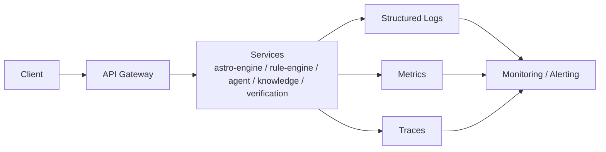

# Pandit Ji — Architecture Diagrams

Referenced from `docs/ARCHITECTURE.md`. All diagrams are Mermaid so they render natively on GitHub and in most editors. These are architecture-level diagrams (Phase 2 deliverable) — they do not imply any of the depicted components are implemented yet.

## System overview

## A. Normal astrology question (chat path)

## B. Calculation authority

The dotted line is intentional: the AI narration layer has no write path into any deterministic-fact table. Facts flow one direction only.

## C. Verification

## D. Async background job

## E. Production observability

